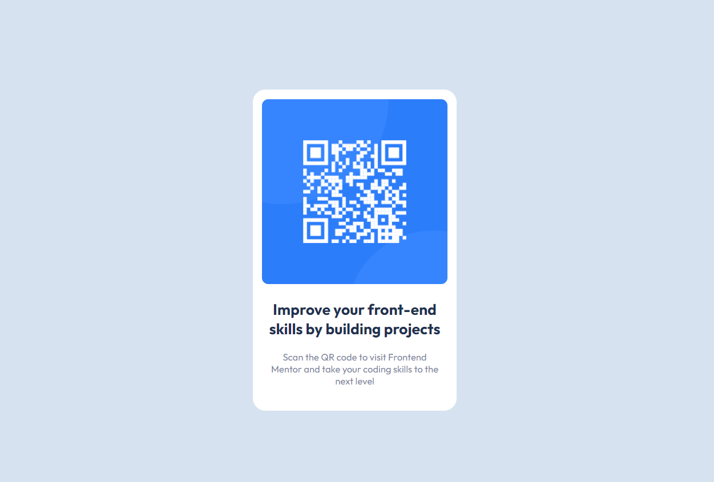

# Frontend Mentor - QR code component solution

This is my solution to the [QR code component challenge on Frontend Mentor](https://www.frontendmentor.io/challenges/qr-code-component-iux_sIO_H).

## Table of contents

- [Overview](#overview)
  - [Screenshot](#screenshot)
  - [Links](#links)
- [My process](#my-process)
  - [Built with](#built-with)
- [Author](#author)

## Overview

### Screenshot

### Links

- Solution URL: [FrontendMentor solution](https://www.frontendmentor.io/solutions/qrcode-with-pure-html-and-css-HyOtaLbL5) 👈
- Live Site URL: [Demo](https://shkotsky.github.io/qr-code-component-main/) 👈

## My process

### Built with

- Semantic HTML5 markup
- CSS

## Author

- Frontend Mentor - [@Shkotsky](https://www.frontendmentor.io/profile/Shkotsky)
- LinkedIn - [@Marko](https://www.linkedin.com/in/marko-hristovski-77b9a6149/)
